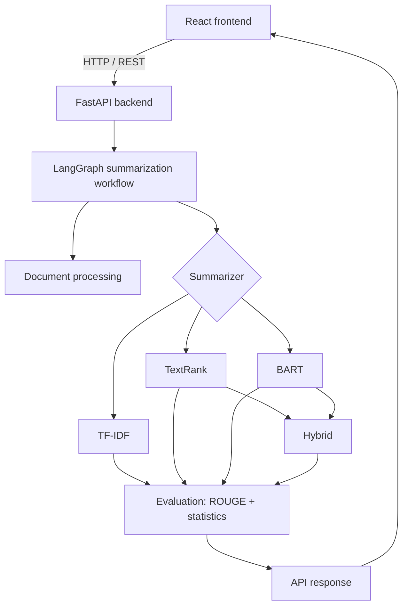

# IntelliSum: Intelligent Text Summarization using NLP and Transformers

*B.Tech Computer Science & Engineering · Minor Project*

> **Project status:** Phase 9 of 15 complete (project skeleton; document loading and preprocessing;
> TF-IDF and TextRank extractive summarization; BART abstractive summarization; long-document chunking;
> Hybrid TextRank → BART; LangGraph workflow; LangChain document processing). Sections below marked
> *(Phase N)* describe work that is planned but **not yet implemented**.

## Table of contents
1. [Project overview](#1-project-overview)
2. [Problem statement](#2-problem-statement)
3. [Objectives](#3-objectives)
4. [Architecture](#4-architecture)
5. [Technologies](#5-technologies)
6. [Extractive summarization](#6-extractive-summarization)
7. [TF-IDF](#7-tf-idf)
8. [TextRank](#8-textrank)
9. [Abstractive summarization](#9-abstractive-summarization)
10. [BART](#10-bart)
11. [LangChain](#11-langchain)
12. [LangGraph](#12-langgraph)
13. [Hybrid summarization](#13-hybrid-summarization)
14. [Long-document strategy](#14-long-document-strategy)
15. [Evaluation](#15-evaluation)
16. [Installation](#16-installation)
17. [Running the backend](#17-running-the-backend)
18. [Running the frontend](#18-running-the-frontend)
19. [API endpoints](#19-api-endpoints)
20. [Experiments](#20-experiments)
21. [Limitations](#21-limitations)
22. [Future work](#22-future-work)

---

## 1. Project overview
IntelliSum summarizes plain text, PDF and DOCX documents with four independently implemented methods:
two classical **extractive** methods (TF-IDF and TextRank), a Transformer-based **abstractive** method (BART),
and a **hybrid** pipeline that combines them. Every summary comes with statistics, and with ROUGE scores
whenever a reference summary is provided. All summarization runs locally; no paid LLM API is used.

## 2. Problem statement
Reading long reports, articles and papers in full is time-consuming. Automatic summarization can condense
them, but each family of techniques has trade-offs. Extractive methods are faithful but choppy. Abstractive
models are fluent but can hallucinate and are limited by a fixed context window. This project implements
both families, compares them on a public benchmark, and combines them to handle long documents.

## 3. Objectives
- Implement TF-IDF and TextRank extractive summarization from first principles (scikit-learn + NetworkX).
- Use a pre-trained Transformer (`facebook/bart-large-cnn`) for abstractive summarization.
- Handle documents longer than the Transformer's context window without silent truncation.
- Design a hybrid TextRank → BART method.
- Orchestrate the pipeline with LangGraph and use LangChain for document handling.
- Evaluate with ROUGE-1/2/L on CNN/DailyMail and report runtime and compression.
- Deliver a usable React dashboard backed by a FastAPI service.

## 4. Architecture



See [docs/architecture.md](docs/architecture.md) for details.

## 5. Technologies
| Area | Tools |
|---|---|
| Frontend | React, Vite, Tailwind CSS, Axios |
| Backend | Python 3.11+, FastAPI, Uvicorn, Pydantic |
| Classical NLP | spaCy, NLTK, scikit-learn, NetworkX |
| Deep learning | PyTorch, Hugging Face Transformers |
| Documents | PyMuPDF, python-docx |
| Orchestration | LangChain (core + text splitters), LangGraph |
| Evaluation | rouge-score, Hugging Face Datasets (experiments only) |

## 6. Extractive summarization
Extractive methods select the most important sentences of the source **verbatim** and keep them in their
original order. Each sentence gets an importance score; the top `k` (12 / 22 / 32 % of sentences for
short / medium / long) are chosen, skipping near-duplicates. Because nothing is generated, an extractive summary
cannot invent facts, and every selection is explainable by its score.
See [methodology §2](docs/methodology.md#2-extractive-summarization).

## 7. TF-IDF
Each sentence becomes a vector of TF-IDF weights (stop words removed, words stemmed with NLTK's Porter stemmer).
Averaging these vectors gives the **document centroid**, which describes the document's main topics. Sentences
are ranked by **cosine similarity to the centroid**. This beat the textbook "average term weight" scoring by
~9–16 ROUGE-1 points in our check, because that scoring rewards rare, off-topic words.
Implementation: [`TFIDFSummarizer`](backend/app/summarizers/tfidf.py).

## 8. TextRank
TextRank treats the document as a **graph**: every sentence is a node, and two sentences are linked by an edge
weighted by their TF-IDF cosine similarity. **PageRank** (NetworkX) then ranks the sentences. A sentence scores
highly when it is similar to many other high-scoring sentences, i.e. it expresses what the document keeps coming
back to. The weakest links (similarity ≤ 0.05) are pruned, and on long documents each sentence keeps only its 50
strongest links, which bounds cost without changing results.
Implementation: [`TextRankSummarizer`](backend/app/summarizers/textrank.py); details and measurements in
[methodology §2.2](docs/methodology.md#22-textrank-appsummarizerstextrankpy).

## 9. Abstractive summarization
Abstractive methods **write** a new summary instead of copying sentences, so they can merge facts, compress
clauses and paraphrase. They rely on Transformer **attention**: while writing each word, the decoder looks back
at the most relevant parts of the source. Because the text is generated, it can also contain statements the
source doesn't support (hallucination).

## 10. BART
[`BARTSummarizer`](backend/app/summarizers/bart.py) uses `facebook/bart-large-cnn`, a ~400 M-parameter
encoder-decoder Transformer pre-trained as a denoising autoencoder and fine-tuned on CNN/DailyMail. It runs
**locally** (GPU if usable, otherwise CPU), is loaded **once, lazily**, and decodes with deterministic 4-beam
search. Summary length follows the short/medium/long ratio. Input longer than BART's 1,024-token window is
**never truncated**. See [methodology §3](docs/methodology.md#3-abstractive-summarization).

## 11. LangChain
LangChain provides the **document-processing layer**, never the summarization algorithm:

- **Loaders** ([`langchain_loaders.py`](backend/app/documents/langchain_loaders.py)): uploads and pasted text
  become LangChain `Document` objects, **one per PDF page** with `source`/`page`/`file_type` metadata (reusing the
  Phase 2 extraction and validation).
- **Page provenance:** preprocessing maps every sentence to the page it starts on, so results can say *"selected
  from page 4"* and long-document chunks report their page ranges. Sentences broken across a page boundary are
  re-joined.
- **Pluggable chunking:** the long-document chunker is a LangChain `TextSplitter`
  ([`SentenceAwareTextSplitter`](backend/app/preprocessing/langchain_splitter.py)). LangChain's
  `RecursiveCharacterTextSplitter` can be swapped in (`INTELLISUM_CHUNKING_STRATEGY=recursive`) to measure what
  respecting sentence boundaries is worth.

The summarizers never import LangChain; preprocessing accepts any object with `page_content` and `metadata`. See
[architecture §7](docs/architecture.md#7-langchain-document-processing).

## 12. LangGraph
Every request runs through one LangGraph **state graph** ([`summarization_graph.py`](backend/app/graph/summarization_graph.py)):
`preprocess` → route by method → (`extractive_summarize` | `select_key_sentences` → `check_length` →
`abstractive_single_pass` or the **chunk → summarize → combine loop** → `final_summarization`) → `postprocess` →
`evaluate`. A typed state records the sentences, selection, chunks, intermediate summaries, the path taken and
per-node timings. LangGraph contributes explicit routing and loops; the nodes contain no algorithms, and tests
confirm the graph gives the same results as calling the summarizers directly.
See [architecture §4](docs/architecture.md#4-langgraph-workflow-appgraph-appcoreworkflowpy).

## 13. Hybrid summarization
[`HybridSummarizer`](backend/app/summarizers/hybrid.py) uses **TextRank as a content selector and BART as a
rewriter**. TextRank reads the whole document and picks its most central sentences (about 3× the requested
summary length, skipping near-duplicates). When the summary fits one BART pass, the selection is capped to one
BART window, so BART needs no chunking. BART then rewrites the selection, with the summary length still based on
the **original** document. The result shows which sentences BART received and how much input it was spared.
See [methodology §5](docs/methodology.md#5-hybrid-textrank--bart-appsummarizershybridpy).

## 14. Long-document strategy
BART reads at most 1,024 tokens (~750 words), and IntelliSum **never truncates**. Longer documents are split into
**balanced chunks of whole sentences** (≤ 900 BART tokens each, measured with BART's own tokenizer), each chunk is
summarized, and the partial summaries are **fused in a final pass** (or, if the requested summary is longer than
one pass can write, returned in order as a section-by-section summary). If the combined summaries are still too
long, the process repeats, for at most 3 rounds.
Implementation: [`chunker.py`](backend/app/preprocessing/chunker.py),
[`long_document.py`](backend/app/summarizers/long_document.py); details in
[methodology §4](docs/methodology.md#4-long-documents-and-chunking).

## 15. Evaluation
*(Phase 10)*: ROUGE-1, ROUGE-2 and ROUGE-L, computed **only** when a reference summary exists, plus word
counts, compression ratio and processing time.

## 16. Installation

Prerequisites: **Python 3.11+** (64-bit), **Node.js 20.19+ / 22.12+**, Git.

```bash
git clone <your-repo-url> intellisum
cd intellisum
```

Backend (Windows PowerShell shown; see [backend/README.md](backend/README.md) for macOS/Linux and GPU notes):

```powershell
cd backend
py -3.14 -m venv .venv
.\.venv\Scripts\Activate.ps1
pip install torch --index-url https://download.pytorch.org/whl/cu126   # or: pip install torch  (CPU only)
pip install -r requirements-dev.txt
python -m spacy download en_core_web_sm
```

Frontend:

```bash
cd frontend
npm install
```

## 17. Running the backend
```powershell
cd backend
.\.venv\Scripts\Activate.ps1
uvicorn app.main:app --reload --port 8000
```
API docs: <http://127.0.0.1:8000/docs>

## 18. Running the frontend
```bash
cd frontend
npm run dev
```
Open <http://localhost:5173>.

## 19. API endpoints
| Method | Path | Status |
|---|---|---|
| GET | `/api/health` | Implemented |
| POST | `/api/summarize/text` | Phase 11 |
| POST | `/api/summarize/file` | Phase 11 |
| POST | `/api/evaluate` | Phase 11 |

See [docs/api.md](docs/api.md).

## 20. Experiments
*(Phase 14)*: see [experiments/README.md](experiments/README.md) and [docs/experiments.md](docs/experiments.md).

## 21. Limitations
*(Phase 15)*

## 22. Future work
*(Phase 15)*: T5 / PEGASUS models, OCR for scanned PDFs, multilingual support.

## Repository structure
```
├── backend/        FastAPI app, NLP pipeline, tests
├── frontend/       React + Vite dashboard
├── experiments/    Evaluation scripts, notebooks, results
└── docs/           Architecture, methodology, experiments, API
```
