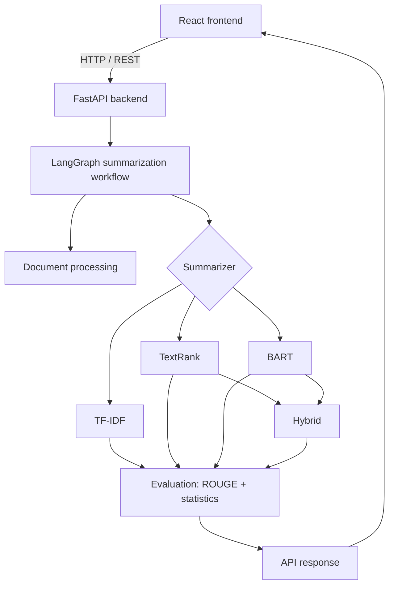

# IntelliSum: Intelligent Text Summarization using NLP and Transformers

*B.Tech Computer Science & Engineering · Minor Project*

> **Project status:** Phase 1 of 15 (project structure, backend & frontend skeletons). Sections below marked
> *(Phase N)* describe work that is planned but **not yet implemented**.

## Table of contents
1. [Project overview](#1-project-overview)
2. [Problem statement](#2-problem-statement)
3. [Objectives](#3-objectives)
4. [Architecture](#4-architecture)
5. [Technologies](#5-technologies)
6. [Extractive summarization](#6-extractive-summarization)
7. [TF-IDF](#7-tf-idf)
8. [TextRank](#8-textrank)
9. [Abstractive summarization](#9-abstractive-summarization)
10. [BART](#10-bart)
11. [LangChain](#11-langchain)
12. [LangGraph](#12-langgraph)
13. [Hybrid summarization](#13-hybrid-summarization)
14. [Long-document strategy](#14-long-document-strategy)
15. [Evaluation](#15-evaluation)
16. [Installation](#16-installation)
17. [Running the backend](#17-running-the-backend)
18. [Running the frontend](#18-running-the-frontend)
19. [API endpoints](#19-api-endpoints)
20. [Experiments](#20-experiments)
21. [Limitations](#21-limitations)
22. [Future work](#22-future-work)

---

## 1. Project overview
IntelliSum summarizes plain text, PDF and DOCX documents with four independently implemented methods:
two classical **extractive** methods (TF-IDF and TextRank), a Transformer-based **abstractive** method (BART),
and a **hybrid** pipeline that combines them. Every summary comes with statistics, and with ROUGE scores
whenever a reference summary is provided. All summarization runs locally; no paid LLM API is used.

## 2. Problem statement
Reading long reports, articles and papers in full is time-consuming. Automatic summarization can condense
them, but each family of techniques has trade-offs. Extractive methods are faithful but choppy. Abstractive
models are fluent but can hallucinate and are limited by a fixed context window. This project implements
both families, compares them on a public benchmark, and combines them to handle long documents.

## 3. Objectives
- Implement TF-IDF and TextRank extractive summarization from first principles (scikit-learn + NetworkX).
- Use a pre-trained Transformer (`facebook/bart-large-cnn`) for abstractive summarization.
- Handle documents longer than the Transformer's context window without silent truncation.
- Design a hybrid TextRank → BART method.
- Orchestrate the pipeline with LangGraph and use LangChain for document handling.
- Evaluate with ROUGE-1/2/L on CNN/DailyMail and report runtime and compression.
- Deliver a usable React dashboard backed by a FastAPI service.

## 4. Architecture



See [docs/architecture.md](docs/architecture.md) for details.

## 5. Technologies
| Area | Tools |
|---|---|
| Frontend | React, Vite, Tailwind CSS, Axios |
| Backend | Python 3.11+, FastAPI, Uvicorn, Pydantic |
| Classical NLP | spaCy, NLTK, scikit-learn, NetworkX |
| Deep learning | PyTorch, Hugging Face Transformers |
| Documents | PyMuPDF, python-docx |
| Orchestration | LangChain (core + text splitters), LangGraph |
| Evaluation | rouge-score, Hugging Face Datasets (experiments only) |

## 6. Extractive summarization
*(Phase 3–4)*: selects the most informative sentences of the source verbatim.

## 7. TF-IDF
*(Phase 3)*

## 8. TextRank
*(Phase 4)*

## 9. Abstractive summarization
*(Phase 5)*: generates new sentences that paraphrase the source.

## 10. BART
*(Phase 5)*

## 11. LangChain
*(Phase 9)*: used for `Document` objects, loader interfaces and text splitting only, never as the
summarization algorithm.

## 12. LangGraph
*(Phase 8)*: a typed state graph with conditional routing between short- and long-document paths.

## 13. Hybrid summarization
*(Phase 7)*: TextRank selects key sentences, then BART rewrites them abstractively.

## 14. Long-document strategy
*(Phase 6)*: sentence-boundary-aware chunking followed by hierarchical (map → combine → reduce) summarization.

## 15. Evaluation
*(Phase 10)*: ROUGE-1, ROUGE-2 and ROUGE-L, computed **only** when a reference summary exists, plus word
counts, compression ratio and processing time.

## 16. Installation

Prerequisites: **Python 3.11+** (64-bit), **Node.js 20.19+ / 22.12+**, Git.

```bash
git clone <your-repo-url> intellisum
cd intellisum
```

Backend (Windows PowerShell shown; see [backend/README.md](backend/README.md) for macOS/Linux and GPU notes):

```powershell
cd backend
py -3.14 -m venv .venv
.\.venv\Scripts\Activate.ps1
pip install torch --index-url https://download.pytorch.org/whl/cu126   # or: pip install torch  (CPU only)
pip install -r requirements-dev.txt
python -m spacy download en_core_web_sm
```

Frontend:

```bash
cd frontend
npm install
```

## 17. Running the backend
```powershell
cd backend
.\.venv\Scripts\Activate.ps1
uvicorn app.main:app --reload --port 8000
```
API docs: <http://127.0.0.1:8000/docs>

## 18. Running the frontend
```bash
cd frontend
npm run dev
```
Open <http://localhost:5173>.

## 19. API endpoints
| Method | Path | Status |
|---|---|---|
| GET | `/api/health` | Implemented |
| POST | `/api/summarize/text` | Phase 11 |
| POST | `/api/summarize/file` | Phase 11 |
| POST | `/api/evaluate` | Phase 11 |

See [docs/api.md](docs/api.md).

## 20. Experiments
*(Phase 14)*: see [experiments/README.md](experiments/README.md) and [docs/experiments.md](docs/experiments.md).

## 21. Limitations
*(Phase 15)*

## 22. Future work
*(Phase 15)*: T5 / PEGASUS models, OCR for scanned PDFs, multilingual support.

## Repository structure
```
├── backend/        FastAPI app, NLP pipeline, tests
├── frontend/       React + Vite dashboard
├── experiments/    Evaluation scripts, notebooks, results
└── docs/           Architecture, methodology, experiments, API
```
