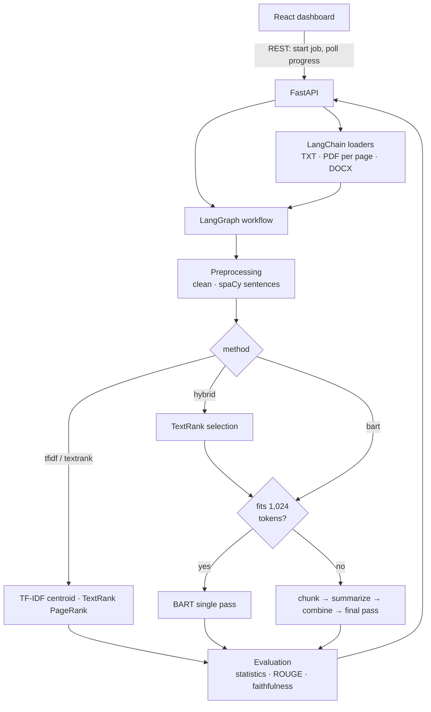
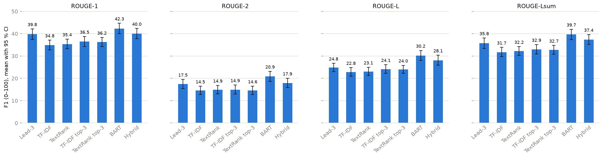

# IntelliSum: Intelligent Text Summarization using NLP and Transformers

[](https://github.com/khushboosolanki20/Text-summarization/actions/workflows/ci.yml)

*B.Tech Computer Science & Engineering · Minor Project*

IntelliSum summarizes pasted text, PDF and DOCX documents with four independently implemented methods (classical
**TF-IDF** and **TextRank**, the Transformer **BART**, and a **Hybrid** of the two), orchestrated by a
**LangGraph** workflow, evaluated with **ROUGE**, and served by a **FastAPI** backend to a **React** dashboard.
Everything runs locally: no paid LLM API is used.

**Highlights**
- Classical algorithms implemented from first principles (scikit-learn, NetworkX), with from-scratch reference
  implementations of PageRank and ROUGE verified against the libraries.
- Long documents are **never truncated**: sentence-aware chunking and hierarchical summarization around BART's
  1,024-token window.
- Evaluated on CNN/DailyMail with confidence intervals and paired comparisons: **BART 42.3 ROUGE-1**, Hybrid
  40.0 at 2.2× BART's speed, Lead-3 baseline 39.8 (matching the published 40.3).
- 339 automated tests, 99 % backend line coverage, CI on Python 3.11 and 3.14.

---

## Table of contents
1. [Project overview](#1-project-overview)
2. [Problem statement](#2-problem-statement)
3. [Objectives](#3-objectives)
4. [Architecture](#4-architecture)
5. [Technologies](#5-technologies)
6. [Extractive summarization](#6-extractive-summarization)
7. [TF-IDF](#7-tf-idf)
8. [TextRank](#8-textrank)
9. [Abstractive summarization](#9-abstractive-summarization)
10. [BART](#10-bart)
11. [LangChain](#11-langchain)
12. [LangGraph](#12-langgraph)
13. [Hybrid summarization](#13-hybrid-summarization)
14. [Long-document strategy](#14-long-document-strategy)
15. [Evaluation](#15-evaluation)
16. [Installation](#16-installation)
17. [Running the backend](#17-running-the-backend)
18. [Running the frontend](#18-running-the-frontend)
19. [API endpoints](#19-api-endpoints)
20. [Experiments](#20-experiments)
21. [Limitations](#21-limitations)
22. [Future work](#22-future-work)

[Documentation](#documentation) · [Repository structure](#repository-structure) · [Acknowledgements](#acknowledgements)

---

## 1. Project overview

A user pastes text or uploads a document, picks a method (**TF-IDF · TextRank · BART · Hybrid**) and a length
(**short · medium · long**), and receives:
- the summary;
- word counts and the compression ratio;
- ROUGE scores, if a reference summary is given;
- for extractive methods, the selected sentences highlighted in the document with their scores and page numbers;
- for abstractive methods, an experimental warning on potentially unsupported sentences;
- the exact route the request took through the workflow.

## 2. Problem statement

Reading long reports, articles and papers in full is time-consuming. Automatic summarization can condense them,
but each family of techniques has trade-offs. **Extractive** methods are faithful but choppy and ignore what they
don't select. **Abstractive** models are fluent but can state things the source doesn't support, and can read only
a limited amount of text at once. The project implements both families, combines them, handles documents of any
length, and measures the trade-offs on a public benchmark.

## 3. Objectives

- Implement TF-IDF and TextRank extractive summarization from first principles.
- Use a pre-trained Transformer (`facebook/bart-large-cnn`) locally for abstractive summarization.
- Handle documents longer than the Transformer's context window without silent truncation.
- Design a hybrid TextRank → BART method.
- Orchestrate the pipeline with LangGraph; use LangChain for document handling.
- Evaluate with ROUGE-1/2/L on CNN/DailyMail and report runtime and compression.
- Deliver a usable React dashboard backed by a FastAPI service.

## 4. Architecture



Layers: `app/api` (HTTP) → `app/core` (service, background jobs) → `app/graph` (LangGraph orchestration) →
`app/summarizers`, `app/preprocessing`, `app/documents`, `app/evaluation` (algorithms). The classical algorithms do
not depend on LangChain, LangGraph or any LLM. Details: [docs/architecture.md](docs/architecture.md).

## 5. Technologies

| Area | Tools |
|---|---|
| Frontend | React 19, Vite, Tailwind CSS, Axios, React Router, Recharts |
| Backend | Python 3.11+, FastAPI, Uvicorn, Pydantic |
| Classical NLP | spaCy (sentences, NER), NLTK (Porter stemmer), scikit-learn (TF-IDF), NetworkX (PageRank) |
| Deep learning | PyTorch, Hugging Face Transformers (`facebook/bart-large-cnn`) |
| Documents | PyMuPDF (PDF), python-docx (DOCX) |
| Orchestration | LangChain (core + text splitters), LangGraph |
| Evaluation | rouge-score; Hugging Face Hub + pandas + matplotlib for experiments |
| Testing | pytest, pytest-cov, Vitest, Testing Library, GitHub Actions |

## 6. Extractive summarization

Extractive methods select the most important sentences of the source **verbatim** and keep them in their original
order. Each sentence gets an importance score; the top `k` (12 / 22 / 32 % of sentences for short / medium / long)
are chosen, skipping near-duplicates (cosine > 0.8). Because nothing is generated, an extractive summary cannot
invent facts, and every selection is explainable by its score.
See [methodology §2](docs/methodology.md#2-extractive-summarization).

## 7. TF-IDF

Each sentence becomes a vector of TF-IDF weights (stop words removed, words stemmed with NLTK's Porter stemmer).
Averaging these vectors gives the **document centroid**, which describes the document's main topics. Sentences are
ranked by **cosine similarity to the centroid**. This beat the textbook "average term weight" scoring by 9–16
ROUGE-1 points, because that scoring rewards rare, off-topic words.
Implementation: [`TFIDFSummarizer`](backend/app/summarizers/tfidf.py).

## 8. TextRank

TextRank treats the document as a **graph**: every sentence is a node, and two sentences are linked by an edge
weighted by their TF-IDF cosine similarity. **PageRank** (NetworkX) then ranks the sentences: a sentence scores highly
when it is similar to many other high-scoring sentences. The weakest links (similarity ≤ 0.05, chosen on validation
data) are pruned, and on long documents each sentence keeps only its 50 strongest links.
Implementation: [`TextRankSummarizer`](backend/app/summarizers/textrank.py);
[methodology §2.2](docs/methodology.md#22-textrank-appsummarizerstextrankpy).

## 9. Abstractive summarization

Abstractive methods **write** a new summary instead of copying sentences, so they can merge facts, compress clauses
and paraphrase. They rely on Transformer **attention**: while writing each word, the decoder looks back at the most
relevant parts of the source. Because the text is generated, it can also contain statements the source doesn't
support (hallucination).

## 10. BART

[`BARTSummarizer`](backend/app/summarizers/bart.py) uses `facebook/bart-large-cnn`, a ~400 M-parameter
encoder-decoder Transformer pre-trained as a denoising autoencoder and fine-tuned on CNN/DailyMail. It runs
**locally**: on the GPU only if a real CUDA operation succeeds, otherwise on the CPU. It is loaded **once, lazily**,
and decodes with deterministic 4-beam search. T5 and PEGASUS plug into the same code (one registry entry each).
See [methodology §3](docs/methodology.md#3-abstractive-summarization).

## 11. LangChain

LangChain provides the **document-processing layer**, never the summarization algorithm:
- **Loaders:** uploads and pasted text become `Document` objects, one per PDF page with page metadata.
- **Page provenance:** every sentence knows its page, and chunks report page ranges. Sentences broken across
  page boundaries are re-joined.
- **Pluggable chunking:** the chunker is a LangChain `TextSplitter`, and LangChain's own
  `RecursiveCharacterTextSplitter` can be swapped in for comparison.

LangChain is confined to two adapter files; the summarizers never import it.
See [architecture §7](docs/architecture.md#7-langchain-document-processing).

## 12. LangGraph

Every request runs through one typed LangGraph **state graph**
([`summarization_graph.py`](backend/app/graph/summarization_graph.py)). It routes by method and by whether the text
fits BART's window, and runs a **chunk → summarize → combine loop** with exit conditions. The state records the
sentences, selection, chunks, intermediate summaries, the path taken and per-node timings, all shown in the UI.
Nodes contain no algorithms, and tests confirm the graph gives the same results as calling the summarizers directly.
See [architecture §4](docs/architecture.md#4-langgraph-workflow-appgraph-appcoreworkflowpy).

## 13. Hybrid summarization

[`HybridSummarizer`](backend/app/summarizers/hybrid.py) uses **TextRank as a content selector and BART as a
rewriter**. TextRank picks the document's most central sentences (about 3× the requested summary length); when the
summary fits one BART pass, the selection is capped to one BART window, so BART never needs chunking. BART rewrites
the selection, with the length based on the **original** document. Result: 40.0 ROUGE-1 at 2.2× BART's speed.
See [methodology §5](docs/methodology.md#5-hybrid-textrank--bart-appsummarizershybridpy).

## 14. Long-document strategy

BART reads at most 1,024 tokens (~750 words), and IntelliSum **never truncates**. Longer documents are split into
**balanced chunks of whole sentences** (≤ 900 BART tokens, measured with BART's own tokenizer). Each chunk is
summarized, and the partial summaries are **fused in a final pass**. If the requested summary is longer than one pass
can write, the chunk summaries are returned in order as a section-by-section summary. If the combined summaries are
still too long, the process repeats (at most 3 rounds).
Implementation: [`chunker.py`](backend/app/preprocessing/chunker.py),
[`long_document.py`](backend/app/summarizers/long_document.py);
[methodology §4](docs/methodology.md#4-long-documents-and-chunking).

## 15. Evaluation

- **ROUGE-1, ROUGE-2, ROUGE-L** (and ROUGE-Lsum), with precision, recall and F1, via Google's `rouge-score`; a
  from-scratch implementation is verified against it. ROUGE is computed **only when a reference summary is
  supplied**; otherwise it is `null` with an explanation. Scores are never estimated.
- **Statistics** for every summary: word counts, compression ratio, sentence counts, sentences selected, processing
  time.
- **Experimental faithfulness check** (BART/Hybrid): flags *"potentially unsupported content"*, i.e. sentences whose
  words, numbers or names are not in the source, with the closest source passage. It is a review aid, not a
  hallucination detector.

See [methodology §7–8](docs/methodology.md#7-faithfulness-check-experimental-appevaluationfaithfulnesspy).

## 16. Installation

Prerequisites: **Python 3.11+** (64-bit), **Node.js 20.19+ / 22.12+**, Git. About 3 GB of disk space (PyTorch and
the 1.6 GB BART model, downloaded automatically on first use).

```bash
git clone https://github.com/khushboosolanki20/Text-summarization.git intellisum
cd intellisum
```

**Backend.** Windows (PowerShell):

```powershell
cd backend
py -3.14 -m venv .venv                 # any Python 3.11+; check versions with: py -0
.\.venv\Scripts\Activate.ps1
pip install torch --index-url https://download.pytorch.org/whl/cu126   # NVIDIA GPU (driver 560+)
# pip install torch                                                    # or CPU only
pip install -r requirements-dev.txt
python -m spacy download en_core_web_sm
```

macOS / Linux: create the environment with `python3 -m venv .venv && source .venv/bin/activate`, then run the same
`pip`/`spacy` commands (use `pip install torch` for CPU). Optional settings: copy `backend/.env.example` to
`backend/.env`. More detail, including GPU troubleshooting: [backend/README.md](backend/README.md).

**Frontend:**

```bash
cd frontend
npm install
```

## 17. Running the backend

```powershell
cd backend
.\.venv\Scripts\Activate.ps1           # macOS/Linux: source .venv/bin/activate
uvicorn app.main:app --reload --port 8000
```

Health check: <http://127.0.0.1:8000/api/health> · interactive API docs: <http://127.0.0.1:8000/docs>.

## 18. Running the frontend

```bash
cd frontend
npm run dev
```

Open <http://localhost:5173> (the backend must be running). Paste text or drag-and-drop a PDF/DOCX/TXT, choose the
method and length, and optionally add a reference summary. Long documents show live progress ("summarizing chunks
3/7"). Results show:
- the original-vs-summary comparison;
- the summary, with copy and download;
- ROUGE chart and table (or a box to add a reference afterwards);
- highlighted source sentences with scores and page numbers;
- the faithfulness warnings;
- the LangGraph route with time per step.

A local history keeps the last 25 summaries in the browser. See [frontend/README.md](frontend/README.md).

### Running the tests

```bash
cd backend && pytest -m "not slow"     # 291 tests, ~1–2 min, 99 % line coverage
cd backend && pytest -m slow           # 9 tests with the real BART model, ~12 min on CPU
cd frontend && npm test                # 39 tests, ~15 s
```

GitHub Actions runs the fast backend suite (Python 3.11 and 3.14) and the frontend lint, tests and build on every
push. See [docs/testing.md](docs/testing.md).

## 19. API endpoints

| Method | Path | Purpose |
|---|---|---|
| POST | `/api/summarize/text` | Summarize text: `{"text", "method", "length", "reference_summary"?}` |
| POST | `/api/summarize/file` | Summarize an uploaded TXT / PDF / DOCX (multipart) |
| POST | `/api/summarize/text/async`, `/api/summarize/file/async` | The same, as a background job |
| GET | `/api/jobs/{job_id}` | Job status and live progress, then the result |
| POST | `/api/evaluate` | ROUGE of any summary against a reference |
| GET | `/api/health`, `/api/config` | Status (device, model loaded); methods, ratios and limits |
| POST | `/api/warmup` | Load BART in the background before the first abstractive request |

Example:

```bash
curl -X POST http://127.0.0.1:8000/api/summarize/text -H "Content-Type: application/json" \
     -d '{"text": "<at least 40 words>", "method": "textrank", "length": "short"}'
```

Every error is `{"detail": "<one readable sentence>"}` with an appropriate status code; stack traces are never
returned. Full reference: [docs/api.md](docs/api.md).

## 20. Experiments

Random CNN/DailyMail **test** articles (500 for the extractive methods; the same first 100 for BART and Hybrid),
95 % bootstrap confidence intervals, paired comparisons on identical articles, and design choices tuned on the
**validation** split.

| Method (same 100 articles) | ROUGE-1 | ROUGE-2 | ROUGE-L | Time / article (CPU) |
|---|---|---|---|---|
| Lead-3 baseline | 39.84 | 17.49 | 24.82 | 0.14 s |
| TF-IDF | 34.84 | 14.54 | 22.82 | 0.20 s |
| TextRank | 35.36 | 14.93 | 23.05 | 0.19 s |
| **BART** | **42.28** | **20.88** | **30.23** | 56.6 s |
| Hybrid | 40.03 | 17.89 | 28.09 | 25.7 s |



- **BART** is best on every metric and the only method significantly better than Lead-3.
- **Hybrid** ties Lead-3, beats both extractive methods by about 5 ROUGE-1, and is 2.2× faster than BART.
- **TF-IDF and TextRank** are statistically indistinguishable (500 articles).
- Extractive methods trail Lead-3 mainly because of *which* sentences they choose, not only summary length: news
  puts key facts first.

Full results, design experiments and discussion: [docs/experiments.md](docs/experiments.md). To reproduce them,
see [experiments/README.md](experiments/README.md).

## 21. Limitations

- **English only** (spaCy model, BART, stop words).
- **No OCR:** scanned PDFs are detected and reported, not read. Tables are skipped. Multi-column PDF layouts may be
  read in an imperfect order.
- **Speed on CPU:** BART takes about a minute per news article and several minutes for long reports. The GPU path
  exists, but needs an NVIDIA driver recent enough for the installed CUDA build.
- **Extractive methods ignore sentence position:** on news, the Lead-3 baseline beats them by ~3.5 ROUGE-1 even at
  equal length. They can also copy noise such as inline image captions.
- **Chunked documents** are summarized chunk by chunk, so context from earlier sections can be lost; very long
  summaries are section-by-section rather than fully fused.
- **Length control is approximate** for BART (a token range, not an exact count). On short articles, our
  ratio-based length scored 2.7 ROUGE-1 below the model's trained length.
- **Evaluation is lexical:** ROUGE measures word overlap, and the faithfulness check is a heuristic, not a
  hallucination detector. Both were tested on news only.
- **Single-user design:** jobs are kept in memory and history in the browser, so there are no accounts and no
  persistence across server restarts.

## 22. Future work

- Run the full CNN/DailyMail test set on a GPU, and compare **T5** and **PEGASUS** (already supported by the code).
- Replace the lexical faithfulness check with a natural-language-inference (entailment) model or sentence embeddings.
- Position-aware extractive scoring (e.g. combining TextRank with a lead bias) for news.
- OCR for scanned PDFs (e.g. Tesseract) and table extraction.
- An "automatic" length option using the model's trained range, and multilingual models (e.g. mBART).
- Persistent storage (database) and authentication for multi-user deployment; streaming progress (SSE/WebSocket)
  instead of polling.

---

## Documentation

| Document | Contents |
|---|---|
| [docs/architecture.md](docs/architecture.md) | Layers, LangGraph workflow and state, LangChain integration, error handling, API, frontend |
| [docs/methodology.md](docs/methodology.md) | Preprocessing, TF-IDF, TextRank, BART, chunking, Hybrid, length control, faithfulness, ROUGE: formulas and measured design decisions |
| [docs/experiments.md](docs/experiments.md) | Experimental setup, results with confidence intervals, design experiments, discussion, threats to validity |
| [docs/api.md](docs/api.md) | REST API reference with examples and error codes |
| [docs/testing.md](docs/testing.md) | Test strategy and inventory |
| [docs/viva-guide.md](docs/viva-guide.md) | Short answers to the key questions about the project |

## Repository structure

```
├── backend/
│   ├── app/
│   │   ├── api/            FastAPI routers and Pydantic schemas
│   │   ├── core/           run_summarization() service, background jobs
│   │   ├── graph/          LangGraph state and workflow
│   │   ├── summarizers/    TF-IDF, TextRank, BART (+T5/PEGASUS), Hybrid, long-document logic, model registry
│   │   ├── preprocessing/  cleaning, sentences, tokenizer, vectors, chunker, LangChain splitter, pipeline
│   │   ├── documents/      TXT/PDF/DOCX extraction, LangChain loaders
│   │   ├── evaluation/     ROUGE, statistics, faithfulness check
│   │   ├── utils/          device (GPU) detection
│   │   ├── config.py       all settings (see .env.example)
│   │   └── main.py         app factory, error handlers
│   ├── tests/              300 pytest tests
│   └── requirements*.txt
├── frontend/
│   └── src/                pages, components (input, results, ui), hooks, services, utils, tests
├── experiments/
│   ├── scripts/            run_comparison, tune_on_validation, summarize_results
│   ├── notebooks/          analysis.ipynb
│   └── results/            per-article CSVs, summaries, charts
├── docs/                   architecture, methodology, experiments, api, testing, viva guide
└── .github/workflows/      CI
```

A `docker-compose.yml` was deliberately not added: the app is a single-user local tool, and the 1.6 GB model plus
GPU passthrough would make containers harder to run on a student laptop than the two commands above.

## Acknowledgements

- Model: [`facebook/bart-large-cnn`](https://huggingface.co/facebook/bart-large-cnn) (Lewis et al., 2019).
- Dataset: [CNN/DailyMail](https://huggingface.co/datasets/abisee/cnn_dailymail) (Hermann et al., 2015;
  See et al., 2017).
- TextRank: Mihalcea & Tarau (2004). Centroid summarization: Radev et al. (2004). ROUGE: Lin (2004).
- Libraries: spaCy, NLTK, scikit-learn, NetworkX, PyTorch, Hugging Face Transformers, LangChain, LangGraph,
  FastAPI, React, Recharts.
