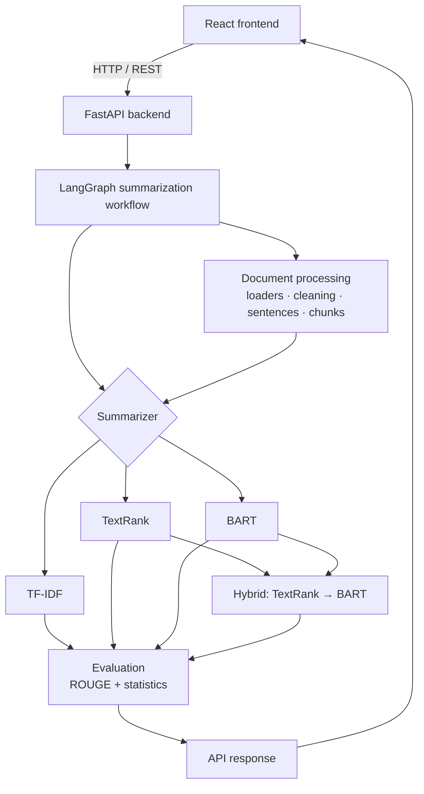
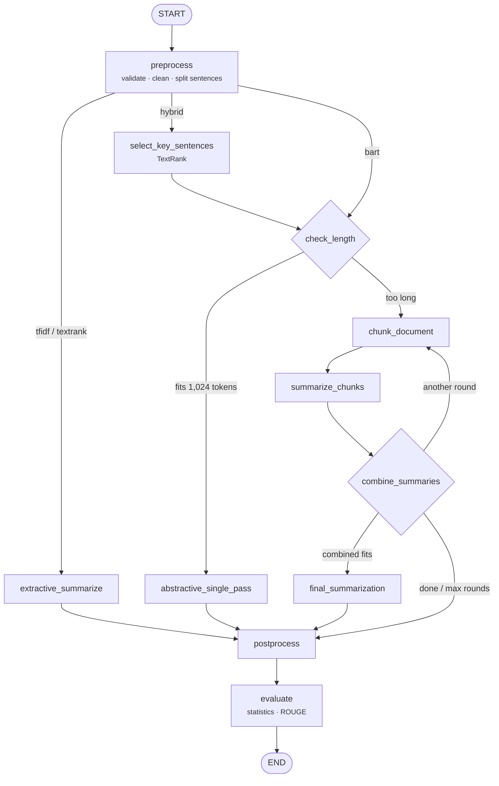

# Architecture

> Status: sections 1–6 reflect the implementation as of Phase 8; API details are completed in Phase 11.

## 1. High-level overview

## 2. Backend layers

| Layer | Package | Responsibility |
|---|---|---|
| HTTP | `app/api` | Request validation, file upload, response models |
| Service | `app/core` | `run_summarization()`: runs the workflow, returns a plain result |
| Orchestration | `app/graph` | LangGraph state + routing |
| Algorithms | `app/summarizers` | TF-IDF, TextRank, BART, Hybrid *(Phases 3-7)* |
| Preprocessing | `app/preprocessing` | Cleaning, sentence splitting, chunking *(Phases 2, 6)* |
| Documents | `app/documents` | TXT / PDF / DOCX loaders *(Phases 2, 9)* |
| Evaluation | `app/evaluation` | ROUGE + statistics *(Phase 10)* |

## 3. Design principles

- Classical algorithms (TF-IDF, TextRank) have **no dependency** on LangChain, LangGraph or any LLM.
- LangChain is used only for document abstractions and splitting, behind a thin adapter so it can be replaced.
- LangGraph only orchestrates; it never contains algorithm logic.
- Transformer models are loaded **once, lazily**, and reused across requests.
- Long documents are **never silently truncated**; they go through hierarchical chunked summarization.

## 4. LangGraph workflow (`app/graph/`, `app/core/workflow.py`)

Every summarization request runs through one compiled LangGraph `StateGraph`. The API (and the experiment
scripts) call `run_summarization(text, method, length)` in `app/core/workflow.py` and receive a plain
`SummarizationOutput`; they never see graph internals.

*Not drawn: every node can also route straight to END when it records an error (see §6).
`build_summarization_graph().get_graph().draw_mermaid()` renders the full compiled graph.*

### 4.1 State

`SummarizationState` (`app/graph/state.py`) is a `TypedDict` shared by all nodes. Each node returns only the keys
it changes; LangGraph merges them in. Keys with a **reducer** are combined rather than replaced:

| Group | Keys |
|---|---|
| Request | `original_text`, `method`, `summary_length`, `reference_summary` |
| Preprocessing | `cleaned_text`, `sentences`, `original_word_count` |
| Selection | `selected_sentences`, `sentence_scores` |
| Abstractive | `work_sentences`, `target_words`, `input_tokens`, `fuse` |
| Long-document loop | `chunk_round`, `chunks`, `intermediate_summaries`, `combined_text`, `next_step`, `reduction_levels` (appended) |
| Output | `final_summary`, `strategy`, `metadata` (merged), `metrics`, `processing_time` |
| Diagnostics | `path` (appended), `timings` (summed per node), `warnings` (appended), `errors` (appended), `error` |

### 4.2 Routing decisions

| Router | Decision |
|---|---|
| after `preprocess` | method: extractive → `extractive_summarize`; hybrid → `select_key_sentences`; bart → `check_length` |
| after `check_length` | input ≤ 1,024 tokens → single pass; otherwise → chunk loop |
| after `combine_summaries` | `final_pass` (combined fits & target fits one pass) · `another_round` (still too long) · `done` (section-by-section summary is the right length) · `max_levels` (stop after 3 rounds, with a warning) |

### 4.3 What LangGraph contributes, and what it doesn't

- **Explicit control flow:** routing and the reduction loop are visible graph edges instead of nested
  if/else and while-loops.
- **A complete record of each run:** path, per-node timings, chunks, intermediate summaries and the strategy used,
  which the API returns and the UI can display.
- **Loops with exit conditions** (chunk → summarize → combine → …), awkward to express as a linear pipeline.
- **No algorithms in nodes:** each node calls the same functions the summarizers use directly
  (`app/summarizers/long_document.py` exposes the loop's steps as `make_chunks`, `round_target`, `next_step`,
  `final_pass`). Unit tests confirm the graph gives *identical* results to calling `TFIDFSummarizer` or
  `HybridSummarizer` directly, so the two cannot drift apart.

The compiled graph is built once per process (`get_graph()`), and the BART model is injected so tests can run
every route in seconds with a stand-in generator.

## 5. Long-document strategy

See [methodology §4](methodology.md#4-long-documents-and-chunking): sentence-aware balanced chunking and
hierarchical map-reduce summarization, implemented as reusable steps that the graph's loop nodes call.

## 6. Error handling

- Every user-caused or model problem is an `IntelliSumError` subclass (`app/errors.py`) carrying a human-readable
  message and an HTTP status code.
- Inside the graph, the `node` wrapper catches an `IntelliSumError`, records `{node, type, message}` in
  `errors`, and every router then sends the run to END; `run_summarization` re-raises it. Unexpected exceptions
  (bugs) are not caught there and reach the API's generic handler, which logs the traceback and returns a generic
  message, so stack traces are never exposed. *(API mapping: Phase 11.)*
- Model failures are isolated: if BART cannot load, TF-IDF and TextRank still work (tested).
