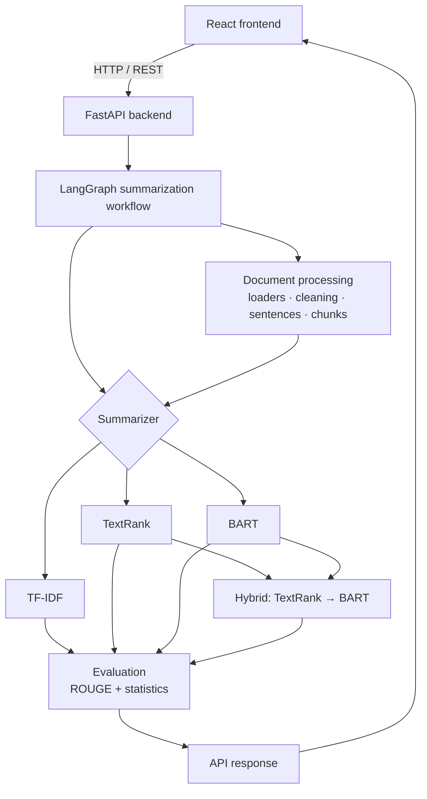

# Architecture

> Status: skeleton (Phase 1). Each section is completed in the phase noted.

## 1. High-level overview

## 2. Backend layers

| Layer | Package | Responsibility |
|---|---|---|
| HTTP | `app/api` | Request validation, file upload, response models |
| Service | `app/core` | Connects API requests to the workflow *(Phase 8/11)* |
| Orchestration | `app/graph` | LangGraph state + routing *(Phase 8)* |
| Algorithms | `app/summarizers` | TF-IDF, TextRank, BART, Hybrid *(Phases 3-7)* |
| Preprocessing | `app/preprocessing` | Cleaning, sentence splitting, chunking *(Phases 2, 6)* |
| Documents | `app/documents` | TXT / PDF / DOCX loaders *(Phases 2, 9)* |
| Evaluation | `app/evaluation` | ROUGE + statistics *(Phase 10)* |

## 3. Design principles

- Classical algorithms (TF-IDF, TextRank) have **no dependency** on LangChain, LangGraph or any LLM.
- LangChain is used only for document abstractions and splitting, behind a thin adapter so it can be replaced.
- LangGraph only orchestrates; it never contains algorithm logic.
- Transformer models are loaded **once, lazily**, and reused across requests.
- Long documents are **never silently truncated**; they go through hierarchical chunked summarization.

## 4. LangGraph workflow *(Phase 8)*

## 5. Long-document strategy *(Phase 6)*

## 6. Error handling *(Phase 11)*
