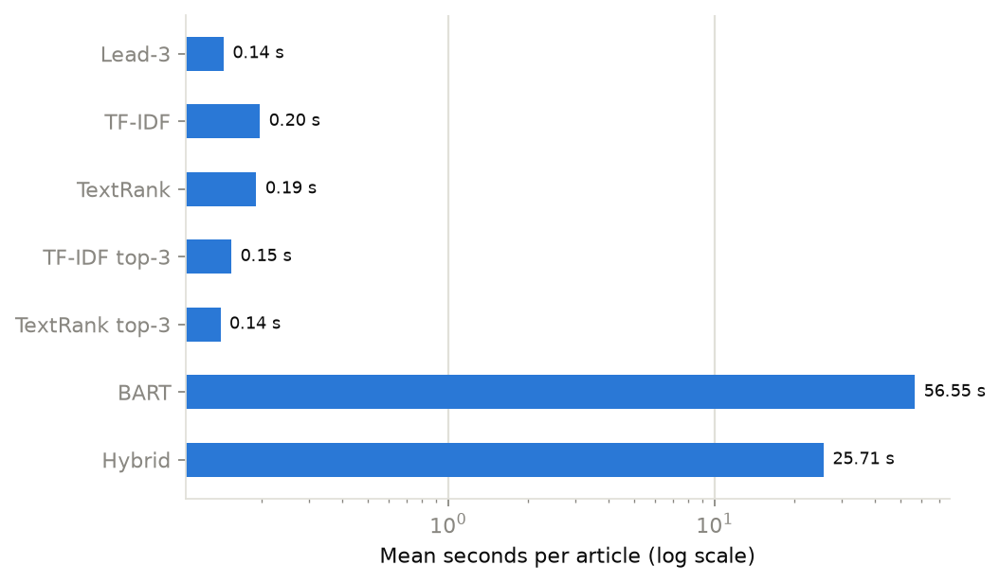

# Experiments

All numbers on this page were produced by the scripts in [`experiments/`](../experiments/README.md) and can be
regenerated with the commands listed there. Raw per-article results, summary tables and charts are in
`experiments/results/`.

## 1. Goal

Compare IntelliSum's four methods (TF-IDF, TextRank, BART, Hybrid) on a public benchmark, against the standard
Lead-3 baseline, on summary quality (ROUGE), speed and compression, and test the main design decisions on
held-out validation data.

## 2. Setup

| | |
|---|---|
| Dataset | CNN/DailyMail 3.0.0 (`abisee/cnn_dailymail`), test split (11,490 articles); validation split for design experiments |
| Sample | Seeded random sample across the whole split (seed 42). Extractive methods and Lead-3: **500 articles**; BART and Hybrid: **the first 100 of those 500** (identical articles, so paired comparison is possible). 468 of the 500 are Daily Mail, 32 CNN, close to the split's mix |
| References | the human-written highlights (mean 51 words) |
| Length setting | `short` (12 % of the input); Lead-3 = first three sentences |
| Metrics | ROUGE-1, ROUGE-2, ROUGE-L and ROUGE-Lsum F1 (Google `rouge-score`, Porter stemming, ×100); summary length; compression; wall-clock time per article |
| Statistics | means with **95 % percentile-bootstrap confidence intervals** (2,000 resamples); **paired** differences on identical articles, marked significant when the CI excludes zero (and ≥ 30 pairs) |
| Hardware | laptop CPU (no usable GPU: driver too old for CUDA 12.6), mains power |
| Code path | the four IntelliSum methods run through the same LangGraph workflow as the web app (`run_summarization`) |

Two lessons from earlier phases shaped the protocol:

- **Sampling must be random.** The test split is ordered: the first ~1,100 articles are CNN, the rest Daily Mail.
  Lead-3 ROUGE-1 was 30.3 on the first 200 articles versus 39.6 on a Daily Mail slice in a Phase 3 check, so
  "the first N rows" would measure CNN only. Experiments shuffle the whole split with a seed and take the first N.
- **Load only the needed split.** `load_dataset("abisee/cnn_dailymail", "3.0.0", split="test")` downloads *all*
  splits (≈ 800 MB plus ≈ 1.3 GB of cache). The scripts download only the needed parquet file (≈ 30 MB).
- **Tune on validation, report on test.** Every design choice below was made on the validation split, so the test
  numbers are not optimistically biased.

## 3. Main results (test split)

### 3.1 All methods on the same 100 articles

| Method | ROUGE-1 | ROUGE-2 | ROUGE-L | ROUGE-Lsum | Words | Compression | Time / article |
|---|---|---|---|---|---|---|---|
| Lead-3 (baseline) | 39.84 (37.4–42.1) | 17.49 (15.5–19.5) | 24.82 (23.0–26.7) | 35.76 (33.4–38.1) | 76 | 85.9 % | 0.14 s |
| TF-IDF | 34.84 (32.7–37.1) | 14.54 (12.8–16.5) | 22.82 (21.0–24.8) | 31.73 (29.8–33.9) | 105 | 84.1 % | 0.20 s |
| TextRank | 35.36 (33.2–37.6) | 14.93 (13.1–16.9) | 23.05 (21.3–25.0) | 32.23 (30.3–34.2) | 105 | 84.0 % | 0.19 s |
| TF-IDF top-3 † | 36.49 (34.3–38.7) | 14.90 (13.0–17.0) | 24.09 (22.3–26.1) | 32.94 (30.9–35.1) | 71 | 86.7 % | 0.15 s |
| TextRank top-3 † | 36.24 (34.2–38.3) | 14.61 (12.8–16.5) | 23.99 (22.2–25.9) | 32.71 (30.8–34.7) | 71 | 86.7 % | 0.14 s |
| **BART** | **42.28** (40.0–44.7) | **20.88** (18.7–23.1) | **30.23** (28.1–32.5) | **39.66** (37.4–42.0) | 70 | 89.3 % | 56.6 s |
| Hybrid | 40.03 (37.8–42.3) | 17.89 (15.9–20.1) | 28.09 (26.0–30.4) | 37.38 (35.2–39.6) | 70 | 89.2 % | 25.7 s |

Mean F1 ×100 with 95 % bootstrap CI. † Length-controlled variants: the method's top three sentences (same budget
as Lead-3), added to separate *selection quality* from *summary length*.

### 3.2 Larger sample for the cheap methods (500 articles)

| Method | ROUGE-1 | ROUGE-2 | ROUGE-L | ROUGE-Lsum |
|---|---|---|---|---|
| Lead-3 | 40.29 (39.3–41.4) | 18.14 | 25.53 | 36.76 |
| TF-IDF | 34.73 (33.8–35.7) | 14.58 | 22.51 | 31.71 |
| TextRank | 35.02 (34.1–36.0) | 14.59 | 22.58 | 31.95 |
| TF-IDF top-3 | 36.16 | 14.58 | 23.44 | 32.71 |
| TextRank top-3 | 36.27 | 14.53 | 23.48 | 32.83 |

Lead-3 at 40.3 ROUGE-1 matches the figure commonly reported for this dataset (≈ 40.3), a sanity check on the whole
evaluation pipeline (sampling, preprocessing and ROUGE configuration).

### 3.3 Paired comparisons (100 identical articles)

| A vs B | ΔROUGE-1 (95 % CI) | ΔROUGE-2 (95 % CI) | Significant? |
|---|---|---|---|
| BART vs Lead-3 | +2.44 (+0.2 to +4.8) | +3.38 (+1.3 to +5.5) | yes |
| BART vs Hybrid | +2.25 (+0.1 to +4.5) | +2.99 (+0.8 to +5.2) | yes |
| Hybrid vs Lead-3 | +0.19 (−2.0 to +2.5) | +0.39 (−1.8 to +2.7) | no |
| Hybrid vs TextRank | +4.67 (+2.9 to +6.5) | +2.96 (+1.1 to +4.9) | yes |
| Hybrid vs TF-IDF | +5.19 (+3.3 to +7.0) | +3.35 (+1.4 to +5.3) | yes |
| Lead-3 vs TextRank | +4.47 (+2.5 to +6.4) | +2.57 (+0.7 to +4.5) | yes |
| Lead-3 vs TextRank top-3 | +3.60 (+1.5 to +5.7) | +2.88 (+0.7 to +5.1) | yes |
| TextRank vs TF-IDF | +0.52 (−0.0 to +1.1) | +0.39 (−0.2 to +0.9) | no |

The full matrix of all pairs is in `experiments/results/test_short_seed42/summary.md`.

### 3.4 Other measurements

- **Chunking in practice:** BART needed hierarchical chunking for **32 of 100** articles (the rest fit in
  1,024 tokens; mean 1.36 chunks). Hybrid needed it for **0 of 100**: its selection is capped to one window.
- **Speed:** extractive methods take 0.1–0.2 s per article (mostly spaCy sentence splitting). Hybrid is **2.2×
  faster than BART** on average (25.7 s vs 56.6 s; medians 22.2 s vs 34.0 s) because BART reads ~3× the summary
  length instead of the whole article and never chunks.
- **Faithfulness check (experimental):** at least one sentence was flagged as potentially unsupported in **13 of 100**
  BART summaries and **10 of 100** Hybrid summaries. A flag is a prompt to verify, not a measured error rate.
- **Errors:** none. All 500 / 100 articles were processed by every method.

## 4. Design experiments (validation split)

### 4.1 Hybrid: how much should TextRank select? (30 articles)

| TextRank selects | ROUGE-1 | ROUGE-2 | ROUGE-L | BART input | Time |
|---|---|---|---|---|---|
| 1.5 × summary length | 39.06 | 15.58 | 26.20 | 167 tokens | 24.2 s |
| 2 × | 40.53 | 17.18 | 27.40 | 221 tokens | 25.4 s |
| **3 × (default)** | **42.74** | **19.66** | **30.02** | 326 tokens | **28.6 s** |
| 4 × | 45.07 | 22.76 | 31.66 | 419 tokens | 40.2 s |

Quality rises steadily as BART receives more context; 4× beats 3× significantly on ROUGE-2 (+3.1) but not on
ROUGE-1 (+2.3, CI −0.3 to +5.2), at **+40 % time**, approaching plain BART's cost. The expansion factor is
therefore a quality/speed dial. **3× was kept as the default** (balanced), and it is configurable
(`INTELLISUM_HYBRID_EXPANSION`).

### 4.2 BART: ratio-based length vs the model's trained length (30 articles that fit one pass)

| Length strategy | ROUGE-1 | ROUGE-2 | ROUGE-L | Words |
|---|---|---|---|---|
| IntelliSum ratio (12 % of input) | 46.34 | 24.09 | 33.39 | 52 |
| bart-large-cnn default (56–142 tokens) | 49.05 | 24.82 | 34.50 | 59 |

The model's default length scores **+2.7 ROUGE-1** (CI +0.1 to +5.7, just significant) and +0.7 ROUGE-2 (not
significant). The mechanism is length: these articles average 472 words, so 12 % gives 52-word summaries, slightly
*shorter* than the 56-word references, which costs recall. IntelliSum keeps ratio-based sizing because
short/medium/long is a user-facing requirement (a 10-page report should get a longer summary than a news story),
but on this benchmark it costs a little ROUGE-1. A possible improvement is an "automatic" length option that uses the
model's trained range.

### 4.3 Chunking: sentence-aware vs LangChain recursive splitter

BART on validation articles longer than its 1,024-token window, chunked either by IntelliSum's
`SentenceAwareTextSplitter` (balanced chunks of whole sentences) or by LangChain's `RecursiveCharacterTextSplitter`
(may cut sentences), with the same chunk size in BART tokens:

| Chunking | Articles | ROUGE-1 | ROUGE-2 | ROUGE-L | Chunks | Time |
|---|---|---|---|---|---|---|
| Sentence-aware (default) | 6 | 46.09 | 20.32 | 27.86 | 2.17 | 182 s |
| LangChain recursive | 6 | 43.65 | 19.41 | 27.20 | 2.17 | 189 s |

The sentence-aware splitter is ahead on every metric (+2.4 ROUGE-1, +0.9 ROUGE-2), but **the result is
inconclusive**: only 6 of the 20 sampled validation articles exceeded the window (most news articles fit), each
took about 3 minutes per strategy on CPU, and the confidence interval of the difference includes zero
(−6.5 to +0.9 ROUGE-1). It is consistent with the motivation (a chunk that ends mid-sentence gives BART a broken
final sentence), but confirming it needs a corpus of long documents and a GPU.

## 5. Discussion

1. **Abstractive beats extractive on this benchmark.** BART is the best method on every ROUGE variant and is the only
   one that significantly beats Lead-3. Its advantage is largest on ROUGE-L (+5.4 over Lead-3), the metric that
   rewards fluent word order: BART compresses and rephrases instead of copying whole sentences.
2. **Hybrid is a good speed/quality compromise.** It ties Lead-3, clearly beats both extractive methods
   (+4.7 / +5.2 ROUGE-1), loses 2.3 ROUGE-1 to BART, and is 2.2× faster, never needing chunking. Section 4.1 shows
   the trade-off is tunable.
3. **TF-IDF ≈ TextRank.** Both are built on the same TF-IDF sentence vectors; the graph structure adds no measurable
   benefit on news (difference 0.3–0.5, not significant even with 500 articles).
4. **Why extractive methods trail Lead-3: selection, not just length.** At the 12 % setting they produce ~105-word
   summaries versus 51-word references, which hurts precision. Restricting them to three sentences recovers
   1–1.7 ROUGE-1, but Lead-3 still wins by ~3.5. News is written as an *inverted pyramid* (key facts first), and
   centrality-based methods that ignore position cannot exploit that.
5. **ROUGE's limits apply.** Scores measure word overlap with one human reference. They favour copying (part of
   Lead-3's strength), are sensitive to length (§4.2), and say nothing about factual accuracy. The faithfulness
   flags (§3.4) and the qualitative examples in `experiments/notebooks/analysis.ipynb` complement them.
6. **Context:** published results for `bart-large-cnn` report ≈ 44 ROUGE-1. Ours is lower (42.3) because we use
   IntelliSum's length setting rather than the model's tuned length (§4.2), chunk long articles instead of truncating
   them, and use a different 100-article sample, so the numbers are not directly comparable.

## 6. Threats to validity

- **Sample size:** 100 articles for BART/Hybrid gives CIs of roughly ±2.3 ROUGE-1; smaller differences (e.g. TF-IDF
  vs TextRank) cannot be resolved there, which is why the cheap methods were also run on 500 articles.
- **One domain, one reference:** results are for English news with a single reference per article; reports, papers
  or legal text may behave differently, especially for Lead-3, whose strength is specific to news.
- **Timing** is wall-clock on one laptop CPU with no GPU; absolute times would be much lower on a GPU, but the
  relative ordering of methods is expected to hold.
- **T5 and PEGASUS** are supported by the code (`--methods t5 pegasus`) but were not run: each needs another
  0.9–2.3 GB download and hours of CPU time.
